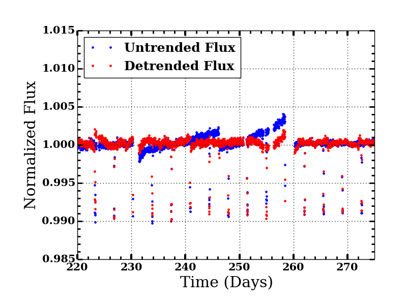
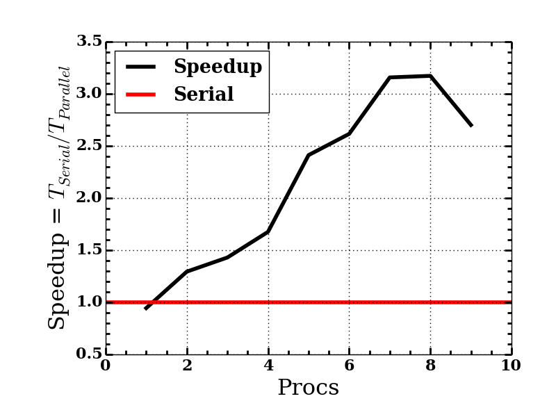

#`kepler_procedures`
This project was an exercise for our graduate class in scientific computing.
Here is a [link to our presentation](https://docs.google.com/presentation/d/1JA7amOs9jUSS1sviu2E3LiKAmCTDrXjJgWz_Xogk7iE/edit?usp=sharing "presentation on this project").
We were interested in taking a serial algorithm and parallelizing it using the Julia programming language.
We implemented a detrending routine for Kepler data.
Detrending removes systematic and stellar variation and allows for transits to be observed without other signals.

Here we have a plot showing the result of detrending.

Notice that the transits are not removed by this process.
Better detrending can be achieved by using a higher order model (currently we use a cubic).

Here we present the performance of parallelization.

These results were obtained by using the LionXJ cluster at Penn. State University.
We used Julia's `DArray` (distributed arrays) and `@spawnat` functions to implement our parallelization.

These `kepler_procedures` make use of several other packages.
+ `PyCall` (allows access to Python packages with Julia)
+ `kplr` (Python package that provides useful tools for downloading Kepler lightcurves)
+ `PyFits` (Needed for kplr)
+ `Optim` (Julia package that provides fitting routines)
+ `PyPlot` (Provides plotting functionality by calling Python's `matlibplot`

#An Overview of the Packages used in this Project
##The `kplr` package
The `kplr` package will provide the greatest functionality with the most ease.
This is a python package but can be used within Julia via the package `PyCall`.

###Installation instructions
Either:
> pip install kplr 

Or:
>git clone https://github.com/dfm/kplr.git

>cd kplr

>python setup.py install 

**And then within Julia:**

> Pkg.add("PyCall")

> Pkg.update()

You will also need to install <code>PyFits</code>: _Issue the following commands:_

> git clone https://github.com/spacetelescope/PyFITS.git 

> cd PyFITS

> python setup.py install

And you are all set!

More documentation here: http://dan.iel.fm/kplr/ 

###Using the `kplr` package
In Julia, issue the following commands:

>julia> using PyCall
 
>julia> @pyimport pyfits
 
>julia> @pyimport kplr
 
>julia> client = kplr.API()
 
>julia> koi=client[:koi](952.01)

##Notes for using PyCall in Julia
The biggest diffence from Python is that object attributes/members are accessed with omyObject[:attribute] rather than myObject.attribute, and you use get(myObject, key) rather than myObject[key].
(This is because Julia does not permit overloading the . operator yet.)
See also the section on <code>PyObject</code> below, as well as the pywrap function to create anonymous modules that simulate . access (this is what <code>@pyimport</code> does).

###Small example
For example, using <code>Biopython</code> we can do:

 >@pyimport Bio.Seq as s

 >@pyimport Bio.Alphabet as a

 >my_dna = s.Seq("AGTACACTGGT", a.generic_dna)

 >my_dna[:find]("ACT")

 >whereas in Python the last step would have been my_dna.find("ACT")

##The `Optim` package

To install:

> Pkg.add("Optim")

> Pkg.update()

Then just:

>using Optim

See the `optim_fittin.ipynb` notebook for an example

#Description of a few important files
##General Description/Documentation
<code>OPEN_ME.ipynb</code> A notebook that describes how to get started and runs several tests.

<code>README.md</code>: This **README.md** file.

<code>koi_list.csv</code>: This is the list of KOI objects, each in one row, the <code>koi_launcher.jl</code> will read this file to check for data for these objects. It includes the following data columns; time, detrended_flux, untrended_flux, flux_error. Do not use the flux_error, it needs to be fixed.

##Julia files
<code>rw_functions.jl</code>: A set of functions for reading and writing the lightcurve data for files. Currently contains only methods for **ascii** data but will also allow for **hdf5** rountines.

<code>client_init.jl</code>: Loads PyCall, kplr and initializes the MAST API client.

<code>get_good_indices.jl</code>: Functions to work with, and remove NaNs in an array.

<code>segment_detrend.jl</code>: Detrends a segment (applies a cubic fit to the data, and subtracts it.

<code>koi_launcher.jl</code>: The overall wrapper program that reads <code>koi_list.csv</code>, gets data using `kplr`, detrends the data, and saves the output data (time, detrended-flux, and original-flux, flux-error) in the <code>lightcurves/</code>/` detrends  Detrends a segment (applies a cubic fit to the data, and subtracts it.
